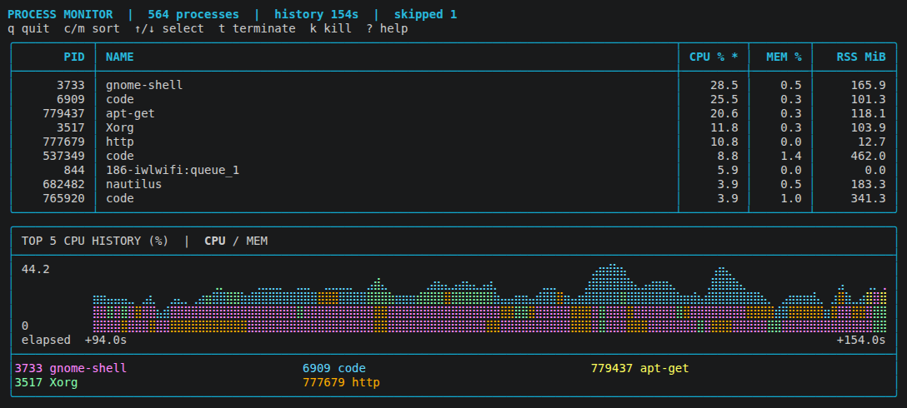

<h1 align="center">Process Monitor</h1>

<p align="center">
  
</p>

<h2 align="center">Written in <a href="https://github.com/namo-robotics/sun">Sun</a></h2>

<p align="center">
  <a href="https://github.com/namo-robotics/process_monitor/actions/workflows/ci.yml">
    
  </a>
</p>

## Supported Platforms

| Operating system                            | Architecture                    |
| ------------------------------------------- | ------------------------------- |
| Linux (release builds target Ubuntu 24.04+) | x86_64 (AMD64), ARM64 (AArch64) |
| macOS 14+                                   | Apple Silicon (ARM64)           |

## Install

```sh
curl -fsSL https://raw.githubusercontent.com/namo-robotics/process_monitor/main/scripts/install.sh | bash
```

Installs the latest stable release to `~/.local/bin`, or the `dev` build if no
stable release exists. Requires a published release. Ensure `~/.local/bin` is on
your `PATH`.

## Usage

A CPU and memory process monitor written in Sun, with colored top-five history
graphs and recording/replay.

```sh
process_monitor
process_monitor --top 5 --sort cpu
process_monitor --record session.jsonl
process_monitor --replay session.jsonl
```

`↑/↓` select · `c/m` CPU/memory · `5/0/a` top 5/10/all · `t/k` terminate/kill ·
Space pause · `?` help · `q` quit. Use `--help` for options.

ROS 2 process labels are also supported.

[Build, usage, and CI details](docs/GUIDE.md) · [Planned work](FOLLOWUP.md) · [Sun feedback](SUN_FEEDBACK.md)
